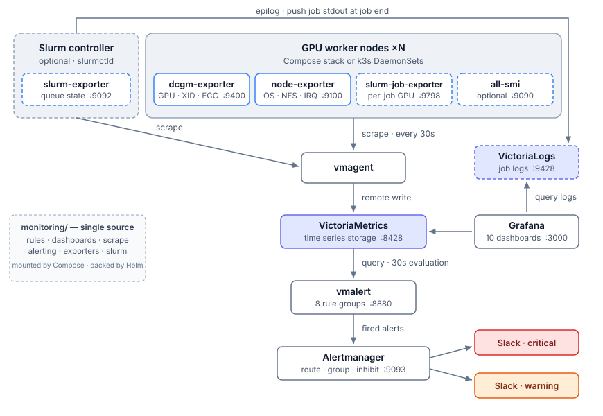

# Algalon

*The Comprehensive Hardware Observer — GPU 클러스터 알림 센터.*

[English](README.md) | **한국어**

Algalon은 대규모 GPU 학습 클러스터를 관측하면서, 단순히 *무언가 고장났다*는
사실이 아니라 *그 장애를 복구하려면 어떤 조치가 필요한지* — 잡을 재시작할지,
GPU를 리셋할지, 노드를 리부팅할지 — 를 운영자에게 알려줍니다. 모든 GPU
노드에서 DCGM, OS, 그리고 선택적으로 크로스 플랫폼 하드웨어 메트릭을 수집해
VictoriaMetrics에 저장하고, 엄선된 일곱 개의 rule 그룹을 vmalert로
평가한 뒤 Alertmanager를 거쳐 Slack으로 라우팅하며, 전체 상황을 여섯 개의
Grafana 대시보드로 보여줍니다. 선택 사항인
[Slurm 연동](docs/ko/slurm.md)을 켜면 rule 그룹 하나와 대시보드 두 개가
더해져 스케줄러 큐 상태와 잡 단위 어카운팅까지 다루므로, 놀고 있는 GPU를
붙잡은 잡과 사용자를 짚어낼 수 있습니다. 역시 선택 사항인 잡 로그
파이프라인을 켜면 Slurm epilog가 종료된 잡의 stdout을 VictoriaLogs로
보내므로, Job Explorer에서 실패한 잡의 출력을 메트릭 바로 옆에서 볼 수
있습니다.

<picture>
  <source media="(prefers-color-scheme: dark)" srcset="docs/images/architecture-dark.svg">
  
</picture>

## Algalon이 만들어진 배경

2026년 Lablup은 *From Detection to Recovery: Operational Analysis on LLM
Pre-training with 504 GPUs*
([arXiv:2605.09370](https://arxiv.org/abs/2605.09370))를 공개했습니다. 504장
규모의 NVIDIA B200 클러스터에서 73일간 쌓인 운영 로그를 분석한 기술
리포트로, 실제로 어떤 하드웨어 장애가 발생했는지, 각 장애 전후로 메트릭이
어떻게 움직였는지, 복구 과정 중 어디까지 자동화할 수 있었는지를 다룹니다.

Algalon은 그 분석 결과를 실제로 돌려볼 수 있는 형태로 옮기려는 시도에서
출발했습니다. 리포트의 XID-복구 조치 매핑, row-remap 열화 사례, 체크포인트
save/load 구간 임계값, NFS 큐 대기 시간 분석이 모두 alert rule과 대시보드로
구현되어 있으며, 각 rule 파일에는 자신이 구현한 절·표·그림 번호가 인용으로
달려 있습니다. 리포트와 함께 쓰인 데이터는 Hugging Face의
[from-detection-to-recovery](https://huggingface.co/datasets/lablup/from-detection-to-recovery)
저장소에 있고, 원문
[리포트 PDF](https://huggingface.co/datasets/lablup/from-detection-to-recovery/blob/main/Lablup_Technical_Report_2026_ko.pdf)도
같은 곳에서 받을 수 있습니다. Algalon이 선택적으로 배포할 수 있는 크로스
플랫폼 exporter인 [all-smi](https://github.com/lablup/all-smi) 역시 Lablup
프로젝트입니다.

이 분석을 학술 연구에 활용한다면 Lablup Inc. (2026)으로 인용해 주시고,
문의는 [lablup.com/contact](https://www.lablup.com/contact)로 보내주세요.

<details>
<summary>BibTeX</summary>

<!-- markdownlint-disable MD013 -->
```bibtex
@misc{arxiv2605.09370,
  title        = {From Detection to Recovery: Operational Analysis on LLM Pre-training with 504 GPUs},
  author       = {{Lablup Inc.}},
  year         = {2026},
  eprint       = {2605.09370},
  archivePrefix = {arXiv},
  primaryClass = {cs.AI},
  note         = {Daemyung Kang, Eunjin Hwang, Hanjeong Lee, HyeokJin Kim, Hyunhoi Koo, Jeongkyu Shin, Jeongseok Kang, Jihyun Kang, Jinho Heo, Joongi Kim, Junbum Lee, Jungseung Yang, Kyujin Cho, and Youngsook Song},
  url          = {https://arxiv.org/abs/2605.09370}
}
```
<!-- markdownlint-enable MD013 -->

</details>

## 시작하기

배포 방식을 하나 고르면 됩니다. 세 가지 모두 동일한 `monitoring/` 내용을
사용하므로 rule과 대시보드는 어느 쪽이든 똑같습니다.

| 방식 | 적합한 환경 | 가이드 |
| --- | --- | --- |
| 로컬 k3s 클러스터 | 온프레미스 GPU 클러스터 (**권장**) | [`deploy/k3s/`](deploy/k3s/README.md) |
| Kubernetes / Helm | 이미 운영 중인 클러스터 | [`deploy/helm/algalon/`](deploy/helm/algalon/README.md) |
| Docker Compose | 단일 노드, 개발 환경, 소규모 클러스터 | [`deploy/compose/`](deploy/compose/README.md) |

[배포 가이드](docs/ko/deployment.md)에서 세 방식을 비교하고, k3s 방식이
호스트의 학습 워크로드(Docker·Apptainer·베어 프로세스)와 어떻게 공존하는지 설명합니다.

## 문서

| 문서 | 내용 |
| --- | --- |
| [아키텍처](docs/ko/architecture.md) | 컴포넌트 파이프라인, 일곱 개 rule 그룹, 알림 정책, 여덟 개 대시보드 |
| [배포](docs/ko/deployment.md) | 배포 방식 선택, k3s와 Docker 공존, 시크릿 관리 |
| [개발](docs/ko/development.md) | 검증 타깃, rule 유닛 테스트, k3d 엔드투엔드 스모크 테스트 |
| [Slurm 연동](docs/ko/slurm.md) | 두 개의 Slurm exporter, 타깃 등록, Slurm 알림과 대시보드, `on(node)` 조인, 선택적인 잡 로그 파이프라인 |

English documentation is in [`docs/`](docs/).

컨트리뷰션 규칙과 이 코드베이스의 눈에 잘 띄지 않는 제약들은
[`AGENTS.md`](AGENTS.md)에 정리되어 있습니다.

## 라이선스

Apache License, Version 2.0으로 배포됩니다. 전문은
[`LICENSE`](LICENSE)를 참고하세요.

---

*관측자 Algalon에서 이름을 따왔습니다 — 우주적인 정밀함으로 여러분의 GPU를
지켜봅니다.*
